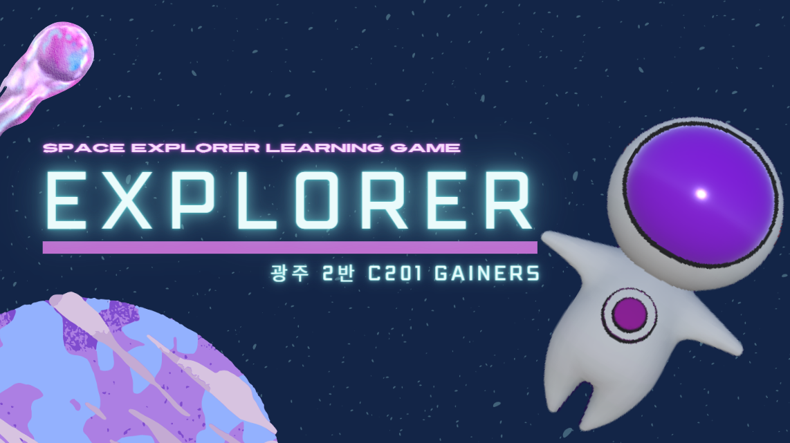
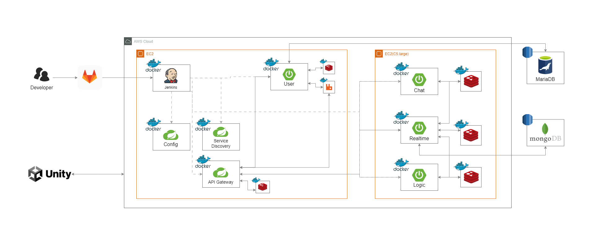
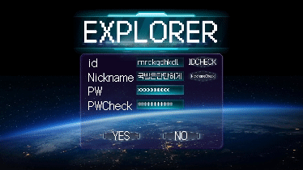
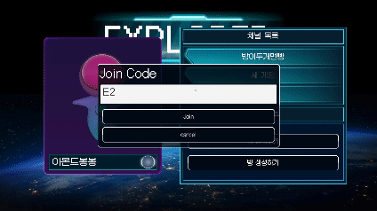
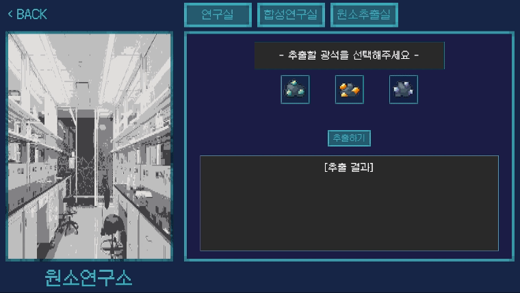

# README.md

생성일: 2024년 4월 23일 오후 3:11




**Framework for Multiplayer Game Real Time Server using Reactor Netty**

### 목차

# 1️⃣ Project Gainers

Reactor Netty 기반 게임 서버

## ① 개요

Reactor Netty 기반의 고성능 비동기 게임 서버 프로젝트입니다. 이 서버는 효율적인 네트워크 통신과 확장 가능한 아키텍처를 제공하여 실시간 멀티플레이어 게임의 요구사항을 충족합니다. 이 프로젝트는 학습 목적, 실험, 그리고 실제 게임 서버 구축을 위해 사용될 수 있습니다.

🔴 Reactor Netty 기반으로 실시간 게임 서버를 개발한 이유

## ② 주요 기능

- **비동기 네트워크 처리** : Reactor Netty를 사용하여 높은 동시성을 처리합니다.
- **확장 가능한 아키텍처** : 모듈화된 설계로 쉽게 기능을 확장할 수 있습니다.
- **실시간 통신** : TCP 통신을 지원하여 실시간 게임 데이터를 처리합니다.
- **데이터 저장** : MongoDB, Redis와의 통합을 통해 게임 데이터를 저장합니다.
- **유닛 테스트** : JMeter를 사용하여 철저한 테스트 커버리지를 보장합니다.

## ③ 기술 스택

- **Framework** : Spring Boot, Project Reactor
- **Networking** : Reactor Netty
- **Database** : MariaDB, MongoDB, Redis
- **Build Tool** : Gradle
- **Test** : JMeter

## ④ 설치 및 실행 방법

### 📌 사전 요구 사항

- Java 17 이상
- MongoDB
- Redis
- MariaDB
- Gradle

### 📌 clone 및 build

```bash
git clone https://lab.ssafy.com/s10-final/S10P31C201.git
cd S10P31C201
./gradlew clean build
```

### 📌 애플리케이션 실행

```bash
./gradlew bootRun
```

## ⑤ 설정

기본 설정은 **`src/main/resources/application.yml`** 파일에서 수정할 수 있습니다.

MongoDB 연결 설정 등 주요 설정을 확인하고 필요에 따라 변경합니다.

- 예시
    
    ```bash
    # MariaDB 설정
    spring.datasource.url=jdbc:mariadb://localhost:3306/yourdatabase
    spring.datasource.username=yourusername
    spring.datasource.password=yourpassword
    
    # MongoDB 설정
    spring.data.mongodb.uri=mongodb://localhost:27017/yourdatabase
    
    # Redis 설정
    spring.redis.host=localhost
    spring.redis.port=6379
    ```
    

## ⑥ DOCS

### Package

- **server** : 프로젝트의 루트 디렉토리입니다.
- **server.api-gateway** : API 게이트웨이 패키지로, 클라이언트 요청을 적절한 마이크로서비스로 라우팅합니다. 요청 및 응답의 인증과 인가, 로깅, 모니터링 등의 공통 기능을 제공합니다.
- **server.chat** : 채팅 서비스 패키지로, 실시간 채팅 기능을 담당합니다. 메시지 송수신 기능을 제공합니다.
- **server.config-service** : 구성 서비스 패키지로, 다른 마이크로서비스의 설정 정보를 중앙에서 관리하고 배포합니다. 설정의 중앙 집중화와 동적 구성을 지원합니다.
- **server.logic** : 게임의 핵심 비즈니스 로직을 처리하는 패키지입니다. 게임 규칙, 상태 관리, 점수 계산 등의 주요 기능을 구현합니다.
- **server.realtime** : 실시간 기능을 담당하는 패키지로, 실시간 데이터 처리 및 전송을 처리합니다. 웹소켓 및 기타 실시간 통신 프로토콜을 통해 클라이언트와 서버 간의 실시간 상호작용을 지원합니다.
- **server.service-discovery** : 서비스 디스커버리 패키지로, 마이크로서비스의 동적 등록과 검색을 관리합니다. 이를 통해 각 서비스가 서로를 찾고 통신할 수 있도록 지원합니다.
- **server.user** : 사용자 관리 패키지로, 사용자 인증 및 인가, 사용자 프로필 관리 등의 기능을 제공합니다.

## ⑦ 기여 방법

기여를 환영합니다! 기여하려면 다음 단계를 따라주세요:

❶ 이 저장소를 Fork하세요

❷ feature 브랜치를 만드세요 (`feature/server-기능명`)

❸ commit 하세요

❹ branch를 push 하세요

❺ Pull Request를 여세요

## ⑧ 라이선스

이 프로젝트는 MIT 라이선스에 따라 라이선스가 부여됩니다.

## ⑨ 문의

질문이나 의견이 있으시면 ‘sjs3326@naver.com’ 으로 이메일을 보내주세요.

# 2️⃣ Game Explorer

> Project Gainers 사용 예제
> 

## ① Game scenario

### 배경

지구가 환경 파괴와 자원 고갈로 인해 더 이상 생명체가 살 수 없는 황폐화된 행성이 되었습니다. 인류는 새로운 안식처를 찾아 이름 없는 행성으로 이주하게 됩니다. 이 행성은 생명체가 살아가기에 적합한 환경을 가지고 있지 않지만, 인류는 이 행성을 지구와 유사한 환경으로 바꾸기 위해 최첨단 기술과 협동을 통해 새로운 삶의 터전을 만들어 나가기로 결심합니다.

### 목표

플레이어는 이 이름 없는 행성을 개척하여 지구 생명체가 꾸준히 살아갈 수 있는 환경을 조성하는 것이 목표입니다. 이를 위해 플레이어는 행성의 자원을 활용하고, 다양한 원소를 추출하고 화합물을 조합하며, 생태계를 복원하는 등 여러 과제를 해결해야 합니다.

### 주요 특징

1. 자원 관리 및 학습
    - 행성에서 발견되는 다양한 원소와 자원을 채집하고 관리합니다.
    - 자원을 효율적으로 사용하여 연구소, 생태계를 건설합니다.
2. 과학적 사실 학습
    - 게임 플레이를 통해 원소들의 특징, 화학적 반응, 태양계 행성들의 특징 등 과학적 사실을 자연스럽게 체득할 수 있습니다.
    - 다양한 미션과 퍼즐을 통해 과학 지식을 응용하고 문제를 해결합니다.
3. 멀티 협동 플레이
    - 플레이어는 협력하여 목표를 달성해야 합니다.
    - 각 플레이어는 특정 역할을 맡아 팀원과 함께 자원을 관리하고, 연구하며, 건설 프로젝트를 진행합니다.
4. 기술 발전
    - 다양한 기술을 연구하고 발전시켜 행성을 개척하는 데 활용합니다.
    - 에너지 관리, 농업 기술, 환경 제어 등 여러 분야의 기술을 개발합니다.

### 학습 요소

이 게임은 단순한 엔터테인먼트를 넘어 교육적인 요소를 제공합니다. 플레이어는 게임을 진행하며 다음과 같은 과학적 사실과 원리를 배우게 됩니다:

- 원소와 화합물 : 주기율표의 원소와 그 특성, 화학 반응과 결합 방법.
- 태양계 행성들 : 태양계 각 행성의 존재하는 원소의 종류.
- 기술과 공학 : 자원 관리, 에너지 변환.

플레이어는 이러한 지식을 활용하여 게임 내 문제를 해결하고 목표를 달성하며, 자연스럽게 과학적 이해를 높이게 됩니다.

## ② About Game

이 프로젝트는 여러 마이크로서비스로 구성되어 있습니다.

### ❶ System Architectur



### ❷ Tech Stack

**🛠 전체**

1. 이슈 관리 : Jira 
2. 형상 관리 : GitLab, Plastic SCM
3. 커뮤니케이션 : Mattermost, Notion, Discord
4. 개발 환경
    - Game Engine : Unity
    - IDE
        - IntelliJ 2023.3.6
        - Visual Studio 2022
    - Database
        - Redis 7.2.4-alpine
        - MongoDB 5.0.26
        - MariaDB 10.3.23
    - Server :
        - EC2
            - T타입의 Large
            - C5 Large
        - Ubuntu 20.04.6 LTS
        

**🛠 상세 내용**

- GAME
    - Csharp
        - .NET Framework 4.6
    - Unity
        - 2022.3.24
- Realtiem Server
    - OpenJDK 17
    - springboot 3.2.5
    - Gradle 8.7
    - Reactor Netty 1.1.18
    - Reactive Redis 3.2.5
    - Reactive Mongo 3.2.5
    - spring Cloud 2023.0.1
- Logic Server
    - OpenJDK 17
    - springboot 3.2.5
    - Gradle 8.7
    - Reactor Netty 1.1.18
    - Reactive Redis 3.2.5
    - spring Cloud 2023.0.1
- User Server
    - OpenJDK 17
    - springboot 3.2.5
    - Gradle 8.7
    - JPA 3.2.5
    - JWT 0.12.2
    - Spring Security 3.2.5
    - MariaDB Data 3.3.3
    - spring Cloud 2023.0.1
- Chat Server
    - OpenJDK 17
    - springboot 3.2.5
    - Gradle 8.7
    - Reactor Netty 1.1.18
    - Reactive Redis 3.2.5
    - RabbitMQ 3.13.2
    - spring Cloud 2023.0.1
- Config Server
    - OpenJDK 17
    - springboot 3.2.5
    - Gradle 8.7
- Discovery Server
    - OpenJDK 17
    - springboot 3.2.5
    - Gradle 8.7
    - spring Cloud 2023.0.1
- API-Gaeway
    - OpenJDK 17
    - springboot 3.2.5
    - Gradle 8.7
    - JWT 0.12.2
    - spring Cloud 2023.0.1
- AWS EC2
    - Ubuntu 20.04.6 LTS
    - Docker 26.1.1
    - Docker compose 2.27.0
    - Jenkins 2.457


## ③ 어뷰징 방지를 위한 게임 로직 검증 및 처리

### **❶ 개요**

게임 서버에서 어뷰징을 방지하기 위해 서버 측에서 게임 로직을 처리하고, 클라이언트로부터 오는 모든 요청을 철저히 검증합니다. 이를 통해 클라이언트 조작으로 인한 부정 행위를 방지하고, 공정한 게임 환경을 유지합니다.

### **❷ 연구소 원소 추출**

- **기능 설명**: 연구소에서 추출 재료 아이템에서 원소를 추출하여 얻습니다.
- **서버 측 처리**: 추출 결과로 나오는 원소의 종류 및 개수는 서버에서 처리됩니다. 연구소의 레벨에 따라 지수 분포를 사용하여 추출 결과를 조정합니다. 레벨이 낮을수록 적은 원소가, 레벨이 높을수록 많은 원소가 추출됩니다.
- **어뷰징 방지**: 클라이언트는 추출 요청만을 서버로 전송하고, 추출 결과는 서버에서 계산하여 클라이언트로 전달합니다. 이를 통해 클라이언트 조작을 방지합니다.

### **❸ 연구소 화합물 합성**

- **기능 설명**: 다양한 재료를 합성하여 화합물을 만듭니다.
- **서버 측 처리**: 합성에 필요한 재료와 보유 재료는 서버의 데이터베이스에 저장된 데이터를 활용합니다. 클라이언트는 합성 요청만을 서버로 전송하며, 필요한 재료의 확인 및 합성 결과는 서버에서 처리합니다.
- **어뷰징 방지**: 합성 로직은 서버에서 전적으로 처리되므로, 클라이언트가 합성에 필요한 재료를 조작할 수 없습니다. 이를 통해 부정 합성을 방지합니다.

### **❹ 연구소 업그레이드**

- **기능 설명**: 연구소를 업그레이드하여 더 강력한 기능을 사용할 수 있게 합니다.
- **서버 측 처리**: 현재 연구소의 레벨과 업그레이드 재료는 서버에 저장된 데이터를 기반으로 합니다. 클라이언트는 업그레이드 요청만을 서버로 전송하며, 업그레이드 가능 여부 및 결과는 서버에서 처리합니다.
- **어뷰징 방지**: 업그레이드 로직이 서버에서 처리되므로, 클라이언트가 현재 연구소의 레벨이나 재료를 조작할 수 없습니다. 이를 통해 불법적인 업그레이드를 방지합니다.

### **❺ 인벤토리 관리**

- **기능 설명**: 플레이어의 인벤토리를 관리합니다.
- **서버 측 처리**: 인벤토리는 Redis를 사용하여 서버에서 관리합니다. 클라이언트로부터 직접 아이템 정보를 받지 않고, 인벤토리의 인덱스 정보만을 받아 서버에서 데이터를 처리합니다.
- **어뷰징 방지**: 모든 아이템 정보는 서버에서 관리되며, 클라이언트가 인덱스 정보를 조작하더라도 서버에서 검증된 데이터를 사용하므로 부정 행위를 방지할 수 있습니다.

### **❻ 인벤토리 아이템 이동**

- **기능 설명**: 인벤토리에서 연구소로 아이템을 이동시킵니다.
- **서버 측 처리**: 인벤토리 및 연구소 아이템 데이터는 서버에서 관리합니다. 클라이언트로부터 직접 아이템 정보를 받지 않고, 인벤토리의 인덱스 정보, 혹은 아이템 카테고리 및 아이템 아이디만을 받아 서버에서 이동 여부, 개수 변경과 관련된 로직을 수행합니다.
- **어뷰징 방지**: 서버는 인벤토리에 있는 아이템이 실제로 존재하는지 확인하고, 이동 가능 여부를 철저히 검증합니다. 이를 통해 클라이언트가 데이터를 조작하여 부정하게 아이템을 이동시키는 것을 방지합니다.

### **❼ 결론**

게임 서버에서 어뷰징을 방지하기 위해서는 모든 중요한 게임 로직을 서버 측에서 처리하고, 클라이언트로부터 오는 모든 요청을 철저히 검증하는 것이 중요합니다. 이를 통해 클라이언트 조작으로 인한 부정 행위를 효과적으로 방지하고, 공정한 게임 환경을 제공할 수 있습니다.

## ④ Unity Game Project

<div style="margin-bottom: 20px; text-align: left;">
    
    <div style="text-align: center; font-weight: bold; margin-top: 10px;">
        로그인페이지
    </div>
</div>

<div style="margin-bottom: 20px; text-align: left;">
    
    <div style="text-align: center; font-weight: bold; margin-top: 10px;">
        비밀번호 유효성검사
    </div>
</div>

<div style="margin-bottom: 20px; text-align: left;">
    
    <div style="text-align: center; font-weight: bold; margin-top: 10px;">
        랜덤 생성 오브젝트 비치
    </div>
</div>

<div style="margin-bottom: 20px; text-align: left;">
    
    <div style="text-align: center; font-weight: bold; margin-top: 10px;">
        연구소 입장
    </div>
</div>

<div style="margin-bottom: 20px; text-align: left;">
    
    <div style="text-align: center; font-weight: bold; margin-top: 10px;">
        방입장코드 입장
    </div>
</div>

<div style="margin-bottom: 20px; text-align: left;">
    
    <div style="text-align: center; font-weight: bold; margin-top: 10px;">
        아이디 유효성검사
    </div>
</div>

<div style="margin-bottom: 20px; text-align: left;">
    
    <div style="text-align: center; font-weight: bold; margin-top: 10px;">
        닉네임 변경및 아바타 적용
    </div>
</div>

<div style="margin-bottom: 20px; text-align: left;">
    
    <div style="text-align: center; font-weight: bold; margin-top: 10px;">
        오브젝트 파괴
    </div>
</div>

<div style="margin-bottom: 20px; text-align: left;">
    
    <div style="text-align: center; font-weight: bold; margin-top: 10px;">
        원소 추출
    </div>
</div>

<div style="margin-bottom: 20px; text-align: left;">
    
    <div style="text-align: center; font-weight: bold; margin-top: 10px;">
        타플레이어와의 소통
    </div>
</div>

<div style="margin-bottom: 20px; text-align: left;">
    
    <div style="text-align: center; font-weight: bold; margin-top: 10px;">
        아이디 중복검사
    </div>
</div>

<div style="margin-bottom: 20px; text-align: left;">
    
    <div style="text-align: center; font-weight: bold; margin-top: 10px;">
        오브젝트 랜덤생성
    </div>
</div>

<div style="margin-bottom: 20px; text-align: left;">
    
    <div style="text-align: center; font-weight: bold; margin-top: 10px;">
        원소 자동획득및 아이템습득
    </div>
</div>

<div style="margin-bottom: 20px; text-align: left;">
    
    <div style="text-align: center; font-weight: bold; margin-top: 10px;">
        광물 추출
    </div>
</div>


## ⑤ MSA :: Realtime Server

실시간 게임 플레이의 핵심적인 요소를 담당하여, 사용자들이 원활하고 일관된 게임 경험을 할 수 있도록 지원합니다. 실시간 통신 및 데이터 동기화를 통해 플레이어 간의 협력과 상호작용을 가능하게 하며, low latency 환경을 제공하여 몰입감을 높입니다. 이를 통해 게임의 동적이고 반응적인 요소를 실현합니다.

### **📌 어뷰징 방지**

**Realtime Server**는 공정하고 즐거운 게임 환경을 유지하기 위해 다양한 어뷰징 방지 기능을 제공합니다:

- **로그 기록** : 모든 중요한 활동을 상세하게 기록하여 이후에 분석하고, 어뷰징 발생 시 신속하게 대응할 수 있도록 합니다.
- **서버 측 이벤트 처리** : 이벤트 처리 시 클라이언트에서 로직을 처리하지 않고, 모든 이벤트를 realtime 서버에 연결된 redis에 있는 데이터를 기반으로 처리합니다. 이를 통해 클라이언트가 게임 로직을 변경하거나 조작할 수 없도록 하여, 공정한 게임 환경을 유지합니다.

### **📌 프로젝트 구조**

```bash
.
└── realtime
    ├── RealtimeApplication.java
    ├── channeldatahandling
    ├── gamedatahandling
    ├── global
    ├── initializing
    ├── servermanaging
    ├── sessionhandling
    └── staticdatahandling
```

### **📌 주요 기능 목록**

- **global** : global 설정 관리, 메시지 브로드캐스팅, 세션 관리, 팀 코드 생성, JSON 변환 기능을 담당합니다.
- **channeldatahandling** : 실시간 채널 데이터를 관리하고 처리합니다.
- **sessionhandling** : 게임 내 세션 관리, 대기실 내 세션 관리를 담당합니다.
- **gamedatahandling :** 게임 관련 데이터의 관리와 처리(제작, 파밍, 인벤토리, 연구실, 이동, 도구 관리)를 담당합니다.
- **servermanaging** : 클라이언트 연결, 요청 처리, 서버 구현 및 초기화를 담당합니다.

### **📌 주요 기능 상세 설명**

**🛠 global**

- 주요 기능
    - **broadcasting** : 메시지의 브로드캐스팅, 멀티캐스팅, 유니캐스팅을 담당합니다.
    - **session** : 클라이언트의 connection 정보 관리를 담당합니다.
    - **teamcode** : 팀 코드 생성을 담당합니다.
    - **db config** : MongoDB, Redis 설정 관리를 담당합니다.
    - **MessageConverter**: 객체를 JSON 형식으로 변환하는 기능을 담당합니다.
- 프로젝트 구조
    
    ```bash
    .
    ├── common
    │   ├── dto
    │   │   └── Message.java
    │   └── enums
    │       └── CastingType.java
    ├── component
    │   ├── broadcasting
    │   │   ├── Broadcasting.java
    │   │   ├── Multicasting.java
    │   │   └── Unicasting.java
    │   ├── session
    │   │   └── SessionManager.java
    │   └── teamcode
    │       └── TeamCodeGenerator.java
    ├── config
    │   ├── FeignClientConfig.java
    │   ├── MongoDevConfig.java
    │   ├── MongoProdConfig.java
    │   └── RedisConfig.java
    ├── mongo
    │   ├── entity
    │   │   ├── Inventory.java
    │   │   ├── InventoryData.java
    │   │   ├── Laboratory.java
    │   │   ├── LaboratoryLevel.java
    │   │   ├── MapData.java
    │   │   └── PositionData.java
    │   └── repository
    │       ├── InventoryDataMongoRepository.java
    │       ├── LaboratoryDataMongoRepository.java
    │       ├── LaboratoryLevelMongoRepository.java
    │       └── MapDataMongoRepository.java
    ├── redis
    │   └── ChannelRepository.java
    └── util
        └── MessageConverter.java
    ```
    

**🛠 channeldatahandling**

- 주요 기능
    - **DeleteChannel** : 채널 삭제 이벤트를 처리합니다.
    - **GetChannelDetails** : 채널 세부 정보 요청 이벤트를 처리합니다.
    - **GetChannelList** : 채널 목록 요청 이벤트를 처리합니다.
    - **GetEndedChannelList** : 종료된 채널 목록 요청 이벤트를 처리합니다.
- 프로젝트 구조
    
    ```bash
    .
    ├── ChannelDataHandler.java
    ├── client
    │   └── UserClient.java
    ├── dto
    │   ├── ChannelDetailsInfo.java
    │   ├── ChannelInfo.java
    │   ├── EndedChannelInfo.java
    │   ├── Message.java
    │   ├── PlayerInfo.java
    │   └── UserInfo.java
    ├── event
    │   ├── DeleteChannel.java
    │   ├── GetChannelDetails.java
    │   ├── GetChannelList.java
    │   └── GetEndedChannelList.java
    └── service
        ├── ChannelService.java
        └── DeleteMongoService.java
    ```
    

**🛠 gamedatahandling :: craft**

- 주요 기능
    - **GetCraftingRecipeList** : 제작 레시피 목록 요청 이벤트를 처리합니다.
- 프로젝트 구조
    
    ```bash
    .
    ├── CraftHandler.java
    ├── dto
    │   ├── CraftInfo.java
    │   └── CraftMaterial.java
    ├── event
    │   └── GetCraftingRecipeList.java
    └── repository
        ├── CraftRecipeRepository.java
        └── CraftRepository.java
    ```
    

**🛠 gamedatahandling :: farming**

- 주요 기능
    - **Farm** : 파밍된 아이템의 데이터를 처리합니다.
    - **DropItem** : 파밍 후 드랍된 아이템의 데이터를 처리합니다.
    - **GetItemFromMap** : 맵에서 아이템을 얻는 이벤트를 처리합니다.
- 프로젝트 구조
    
    ```bash
    .
    ├── FarmingHandler.java
    ├── event
    │   ├── DropItem.java
    │   ├── Farm.java
    │   └── GetItemFromMap.java
    ├── exception
    │   ├── FarmingErrorCode.java
    │   └── FarmingException.java
    └── repository
        ├── FarmableRepository.java
        ├── ItemRepository.java
        └── MapInfoRepository.java
    ```
    

**🛠 gamedatahandling :: laboratory**

- 주요 기능
    - EnterLab : 연구실 입장 이벤트를 처리합니다.
    - LeaveLab : 연구실 퇴장 이벤트를 처리합니다.
    - Extract : 연구실에서 추출 작업 이벤트를 처리합니다.
    - Synthesize : 연구실에서 합성 작업 이벤트를 처리합니다.
    - Upgrade : 연구실 업그레이드 이벤트를 처리합니다.
- 프로젝트 구조
    
    ```bash
    .
    ├── LaboratoryHandler.java
    ├── dto
    │   ├── ItemInfo.java
    │   └── UserInfo.java
    ├── event
    │   ├── EnterLab.java
    │   ├── Extract.java
    │   ├── LeaveLab.java
    │   ├── Synthesize.java
    │   └── Upgrade.java
    └── repository
        ├── ElementLaboratoryRepository.java
        ├── InventoryRepository.java
        ├── LaboratoryLevelRepository.java
        └── UseLaboratoryRepository.java
    ```
    

**🛠 gamedatahandling :: moving**

- 주요 기능
    - Moving : 캐릭터 이동 이벤트를 처리합니다.
- 프로젝트 구조
    
    ```bash
    .
    ├── MovingHandler.java
    └── event
        └── Moving.java
    ```
    

**🛠 gamedatahandling :: inventory**

- 주요 기능
    - DropItemInInventory : 인벤토리에서 아이템을 버리는 이벤트를 처리합니다.
    - MoveItemInInventory : 인벤토리 내에서 아이템을 이동하는 이벤트를 처리합니다.
    - UseItemInInventory : 인벤토리에서 아이템을 사용하는 이벤트를 처리합니다.
- 프로젝트 구조
    
    ```bash
    .
    ├── InventoryHandler.java
    ├── dto
    │   ├── InventoryResponse.java
    │   └── ItemInfo.java
    ├── event
    │   ├── DropItemInInventory.java
    │   ├── MoveItemInInventory.java
    │   └── UseItemInInventory.java
    └── exception
        ├── InventoryErrorCode.java
        └── InventoryException.java
    ```
    

**🛠 gamedatahandling :: logicserver**

- 주요 기능
    - **ToLogicServer** : 로직 서버와의 통신을 처리합니다.
- 프로젝트 구조
    
    ```bash
    .
    └── ToLogicServer.java
    ```
    

**🛠 gamedatahandling :: tool**

- 주요 기능
    - AttachTool : 도구를 부착하는 이벤트를 처리합니다.
    - DetachTool : 도구를 분리하는 이벤트를 처리합니다.
- 프로젝트 구조
    
    ```bash
    .
    ├── ToolHandler.java
    ├── event
    │   ├── AttachTool.java
    │   └── DetachTool.java
    ├── exception
    │   ├── ToolErrorCode.java
    │   └── ToolException.java
    └── repository
        └── ToolRepository.java
    ```
    

**🛠 sessionhandling :: ingame**

- 주요 기능
    - StartGame : 게임 시작 이벤트를 처리합니다.
    - RestartGame : 게임 재시작 이벤트를 처리합니다.
    - EndGame : 게임 종료 이벤트를 처리합니다.
    - FindUserData : 사용자 데이터를 찾는 이벤트를 처리합니다.
    - IngameBroadcastPosition : 게임 내 위치 브로드캐스트 이벤트를 처리합니다.
    - InitializeSaveLabData : 연구실 데이터를 초기화하고 저장하는 이벤트를 처리합니다.
    - InventoryDataMongoToRedis : 인벤토리 데이터를 MongoDB에서 Redis로 전송하는 이벤트를 처리합니다.
    - LabDataMongoToRedis : 연구실 데이터를 MongoDB에서 Redis로 전송하는 이벤트를 처리합니다.
    - LabLevelDataMongoToRedis : 연구실 레벨 데이터를 MongoDB에서 Redis로 전송하는 이벤트를 처리합니다.
    - MapDataMongoToRedis : 맵 데이터를 MongoDB에서 Redis로 전송하는 이벤트를 처리합니다.
    - UserInfoData : 사용자 정보 데이터를 처리하는 이벤트를 처리합니다.
- 프로젝트 구조
    
    ```bash
    .
    ├── InGameSessionHandler.java
    ├── document
    │   └── Channel.java
    ├── dto
    │   └── UserInfo.java
    ├── enums
    │   └── Status.java
    ├── event
    │   ├── EndGame.java
    │   ├── FindUserData.java
    │   ├── IngameBroadcastPosition.java
    │   ├── InitializeSaveLabData.java
    │   ├── InventoryDataMongoToRedis.java
    │   ├── LabDataMongoToRedis.java
    │   ├── LabLevelDataMongoToRedis.java
    │   ├── MapDataMongoToRedis.java
    │   ├── RestartGame.java
    │   ├── StartGame.java
    │   └── UserInfoData.java
    └── repository
        ├── ChannelMongoRepository.java
        ├── ElementLaboratoryRepository.java
        └── LaboratoryLevelRepository.java
    ```
    

**🛠 sessionhandling :: ingame**

- 주요 기능
    - CreateWaitingRoom : 대기실 생성 이벤트를 처리합니다.
    - JoinWaitingRoom : 대기실 참가 이벤트를 처리합니다.
    - LeaveWaitingRoom : 대기실 떠나기 이벤트를 처리합니다.
    - DeleteWaitingRoom : 대기실 삭제 이벤트를 처리합니다.
    - GetWaitingRoomHeadcount : 대기실 인원 수 조회 이벤트를 처리합니다.
    - BroadcastPosition : 대기실 내 위치 브로드캐스트 이벤트를 처리합니다.
- 프로젝트 구조
    
    ```bash
    .
    ├── WaitingRoomSessionHandler.java
    ├── dto
    │   └── UserInfo.java
    ├── event
    │   ├── BroadcastPosition.java
    │   ├── CreateWaitingRoom.java
    │   ├── DeleteWaitingRoom.java
    │   ├── GetWaitingRoomHeadcount.java
    │   ├── JoinWaitingRoom.java
    │   └── LeaveWaitingRoom.java
    ├── exception
    │   ├── WaitingRoomErrorCode.java
    │   └── WaitingRoomException.java
    └── repository
        └── UserRepository.java
    ```
    

**🛠 servermanaging**

- 주요 기능
    - ServerImpl : TCP 서버의 핵심 구현 로직을 담당합니다.
    - ServerInitializer : TCP 서버 초기화 로직을 처리합니다.
    - ConnectionHandler : 클라이언트 연결을 관리합니다.
    - RequestHandler : 클라이언트 요청을 처리합니다.
- 프로젝트 구조
    
    ```bash
    .
    ├── ConnectionHandler.java
    ├── RequestHandler.java
    ├── ServerImpl.java
    └── ServerInitializer.java
    ```
    

## ⑥ Logic Server

게임의 핵심 비즈니스 로직을 처리하는 역할을 담당합니다. 이를 통해 확률 계산 및 상태 관리 기능을 구현하여 게임의 일관성과 공정성을 유지합니다. Logic Server는 고성능, 확장성을 고려하여 설계되었으며, 다양한 게임 기능을 지원합니다.

### **📌 어뷰징 방지**

**Logic Server**는 공정하고 즐거운 게임 환경을 유지하기 위해 다양한 어뷰징 방지 기능을 제공합니다:

- **서버 측 비즈니스 로직 처리**: 연구소에서의 원소 추출, 원소 합

### **📌 프로젝트 구조**

```bash
.
└── logic
    ├── LogicApplication.java
    ├── farm
    ├── global
    ├── laboratory
    └── servermanaging
```

### 📌 주요 기능 목록

- **global** : 글로벌 설정 및 공통 기능을 관리합니다.
- **farm** : 아이템 파밍 관련 기능과 로직을 처리합니다.
- **laboratory** : 연구소 관련 기능과 로직을 처리합니다.
- **servermanaging** : 서버의 초기화, 요청 처리, 연결 관리 등 서버 관리 기능을 담당합니다.

### 📌 주요 기능 상세 설명

🛠 **global**

- 주요 기능
    - **RedisConfig** : Redis 설정을 관리합니다. (redis-staticgame)
- 프로젝트 구조
    
    ```bash
    .
    └── config
        └── RedisConfig.java
    ```
    

**🛠 farm**

- 주요 기능
    - **Calculate** : 파밍 시 드랍되는 아이템의 종류 및 개수를 계산하는 로직을 처리합니다.
- 프로젝트 구조
    
    ```bash
    .
    ├── FarmHandler.java
    ├── event
    │   └── Calculate.java
    └── respository
        └── FarmRepository.java
    ```
    

**🛠 laboratory :: extract**

- 주요 기능
    - **Calculate** : 원소 추출 시 나올 수 있는 원소의 종류 및 개수를 계산하는 로직을 처리합니다.
- 프로젝트 구조
    
    ```bash
    .
    ├── LabExtractHandler.java
    ├── event
    │   └── Calculate.java
    └── repository
        └── ExtractionMaterialRepository.java
    ```
    

**🛠 laboratory :: synthesize**

- 주요 기능
    - **GetElements** : 원소 합성 시 필요한 재료를 조회하는 로직을 처리합니다.
- 프로젝트 구조
    
    ```bash
    .
    ├── LabSynthesizeHandler.java
    ├── event
    │   └── GetElements.java
    └── repository
        └── ElementsForCompoundRepository.java
    ```
    

**🛠 laboratory :: upgrade**

- 주요 기능
    - **GetMaterials** : 연구소 업그레이드 시 필요한 재료를 조회하는 로직을 처리합니다.
- 프로젝트 구조
    
    ```bash
    .
    ├── LabUpgradeHandler.java
    ├── event
    │   └── GetMaterials.java
    └── repository
        └── UpgradeMaterialRepository.java
    ```
    

**🛠 servermanaging**

- 주요 기능
    - **ServerImpl** : HTTP 서버의 핵심 구현 로직을 담당합니다.
    - **ServerInitializer** : HTTP 서버 초기화 로직을 처리합니다.
    - **RequestHandler** : realtime 서버의 요청을 처리합니다.
- 프로젝트 구조
    
    ```bash
    .
    ├── RequestHandler.java
    ├── ServerImpl.java
    └── ServerInitializer.java
    ```
    

## ⑦ MSA :: Chat Server

게임 내 실시간 채팅 기능을 담당하는 역할을 합니다. 이를 통해 플레이어들이 원활하게 의사소통을 할 수 있으며, 협력과 전략 수립이 가능해집니다.

### 📌 프로젝트 구조

```bash
.
└── chat
    ├── ChatApplication.java
    ├── chathandling
    ├── global
    └── servermanaging
```

### 📌 주요 기능 목록

- **global** : 글로벌 설정 및 공통 기능을 관리합니다.
- **chathandling** : 채팅 관련 데이터를 관리하고 처리합니다.
- **servermanaging** : 서버의 초기화, 요청 처리, 연결 관리 등을 담당합니다.

## ⑧ MSA :: User Server

사용자 관리와 관련된 모든 기능을 담당합니다. 사용자 인증, 프로필 관리 기능 제공하여 안정적이고 일관된 사용자 경험을 보장합니다. User Server는 보안과 확장성을 고려하여 설계되었습니다.

### 📌 프로젝트 구조

```bash
.
└── user
    ├── UserApplication.java
    ├── domain
    │   └── user
    └── global
        ├── common
        ├── component
        ├── config
        └── error
```

### 📌 주요 기능 목록

- **domain.user** : 사용자 도메인 관련 로직을 처리합니다.
- **global** : 글로벌 설정 및 공통 기능을 관리합니다.

## ⑨ MSA :: Service-Discovery

마이크로서비스 아키텍처에서 각 서비스의 위치를 동적으로 등록하고 검색할 수 있도록 지원하여, 서비스 간의 통신을 원활하게 합니다.

### **📌 프로젝트 구조**

```bash
.
└── servicediscovery
    └── ServiceDiscoveryApplication.java
```

### 📌 주요 기능 목록

- **ServiceDiscoveryApplication** : 서비스 디스커버리 서버 애플리케이션의 진입점으로, 전체 애플리케이션을 초기화하고 실행합니다.

## ⑩ Config Server

마이크로서비스 아키텍처에서 중앙 집중식 설정 관리를 제공하여, 각 서비스의 설정을 동적으로 로드하고 업데이트할 수 있도록 지원합니다

### 📌 프로젝트 구조

```bash
.
└── configservice
    └── ConfigServiceApplication.java
```

### 📌 주요 기능 목록

- **ServiceDiscoveryApplication** : 구성 서비스 서버 애플리케이션의 진입점으로, 전체 애플리케이션을 초기화하고 실행합니다.

## **⑪** API Gateway

클라이언트 요청을 적절한 마이크로서비스로 라우팅하고, 인증, 인가, 로깅, 모니터링 등의 공통 기능을 제공합니다. 이를 통해 마이크로서비스 아키텍처에서 중앙 집중식 관리를 가능하게 합니다.

### 📌 프로젝트 구조

```bash
.
└── apigateway
    ├── ApiGatewayApplication.java
    └── global
        ├── common
        ├── config
        ├── error
        ├── filter
        └── jwt
```

### 📌 주요 기능 목록

- **common** : 공통 DTO를 포함합니다.
- **config** : 글로벌 설정을 관리합니다.
- **error** : 글로벌 예외 처리를 포함합니다.
- **filter** : 필터 관련 기능을 포함합니다.
- **jwt** : JWT 관련 기능을 포함합니다.

## **⑫** Game Data

### ❶ MongoDB

- Channel
    - 채널 유저 정보
    
    ```json
    {
        "_id" : ObjectId({id}),
        "name" : {channelId},
        "status" : "IN_PROGRESS",
        "playerList" : [
            {
                "userId" : {userId},
                "nickname" : {nickname},
                "avatar" : {avatar}
            }
        ],
        "createdAt" : ISODate,
        "updatedAt" : ISODate,
    }
    ```
    
- Inventory
    - 특정 채널의 특정 유저의 인벤토리 정보
    
    ```json
    {
        "_id" : ObjectId({id}),
        "channelId" : {channelId},
        "userId" : {userId},
        "inventoryData" : [
            {
                "inventoryIdx" : {inventoryIdx},
                "itemCategory" : {itemCategory},
                "itemId" : {itemId},
                "itemCnt" : {itemCnt},
                "isFull" : {isFull}
            },
            {
                 "inventoryIdx" : {inventoryIdx},
                "itemCategory" : {itemCategory},
                "itemId" : {itemId},
                "itemCnt" : {itemCnt},
                "isFull" : {isFull}
            }
        ],
    }
    ```
    
- Laboratory
    - 채널의 연구실에 보유 중인 원소, 화합물의 개수
    
    ```json
    {
        "_id" : ObjectId({id}),
        "channelId" : {channelId},
        "labId" : {labId},
        "itemCategory" : {itemCategory},
        "itemCnt" : [ {itemCnt}, {itemCnt}, {itemCnt}, ... ]
    }
    ```
    
- LaboratoryLevel
    - 채널의 연구실 레벨 정보
    
    ```json
    {
        "_id" : ObjectId({id}),
        "channelId" : {channelId},
        "labId" : {labId},
        "level" : {level},
    }
    ```
    
- MapData
    - 채널의 맵 오브젝트 정보
    
    ```json
    {
        "_id" : ObjectId({id}),
        "channelId" : {channelId},
        "mapId" : {mapId},
        "positions" : [
            {
                "position" : {position}
                "itemCategory" : {itemCategory},
                "isFarmable" : {isFarmable},
                "itemId" : {itemId}
            },
           {
                "position" : {position}
                "itemCategory" : {itemCategory},
                "isFarmable" : {isFarmable},
                "itemId" : {itemId}
            },
            ...
        ]
    }
    ```
    
- Map
    - 파밍 오브젝트가 존재할 수 있는 모든 좌표 정보
    
    ```json
    {
        "_id" : {mapId},
        "position" : [{position}, {position}, {position}, ... ]
    }
    ```
    

### ❷ Redis :: channel

- 현재 접속 중인 맵 정보 - hash 데이터 구조
    - key : currentMapId:{channelId}
    - value
        
        
        | field  | value  |
        | --- | --- |
        | mapId | {mapId} |
- 현재 접속 중인 채널 정보 - hash 데이터 구조
    - key : channel:{channelId}
    - value
        
        
        | field  | value  |
        | --- | --- |
        | {userId} | {mapId} |
- 현재 접속 중인 유저 정보 - hash 데이터 구조
    - key : user:{userId}
    - value
        
        
        | field | value |
        | --- | --- |
        | nickname | {nickname} |
        | avatar | {avatar} |
        | channelId | {channelId} |
        | mapId | {mapId} |

### ❸ Redis :: game

- 현재 접속 중인 채널의 연구소 원소 정보 - list 구조
    - key : labData:{channelId}:element
    - value : [{itemCnt}, {itemCnt}, {itemCnt}, … ]
- 현재 접속 중인 채널의 연구소 합성물 정보 - list 구조
    - key : labData:{channelId}:compound
    - value : [{itemCnt}, {itemCnt}, {itemCnt}, … ]
- 현재 접속 중인 채널의 연구소 레벨 정보 - String 구조
    - key : labLevel:{channelId}:{labIdx}
    - value : {level}
- 현재 접속 중인 채널의 맵 정보 - hash 데이터 구조
    - key : mapData:{channelId}:{mapId}
    - value
        
        
        | field  | value  |
        | --- | --- |
        | {position} | {itemCategory}:{isFarmable}:{itemIdx} |
- 현재 접속 중인 채널의 유저 정보 - hash 데이터 구조
    - key : playerInfoData:{channelId}:{userId}
    - value
        
        
        | field | value |
        | --- | --- |
        | nickname | {nickname} |
        | avatar | {avatar} |
        | inventoryCnt | {inventoryCnt} |
        | tool | Boolean |
- 현재 접속 중인 채널의 유저 인벤토리 정보 - hash 데이터 구조
    - key : inventoryData:{channelId}:{userId}
    - value
        
        
        | field  | value |
        | --- | --- |
        | {inventoryId} | {itemCategory}:{itemId}:{itemCnt}:{isFull} |

### ❸ Redis :: staticgame

- 맵 전체 위치 좌표 - list 구조
    - key : map{mapId}
    - value : [{position}, {position}, {position}, …]
- 아이템 합성 재료 - hash 데이터 구조
    - key : synthesize:compound:{itemId}
    - value
        
        
        | field  | value  |
        | --- | --- |
        | {itemCategory}:{itmeId} | {itemCnt} |
- 원소 연구소 업그레이드 재료 - hash 데이터 구조
    - key : upgradeMaterial:elementLab:{level}
    - value
        
        
        | field  | value |
        | --- | --- |
        | {itemCategory}:{itemId} | {itemCnt} |
- 원소 연구소 레벨 별 효율 정보 - String 구조
    - key : LabEffciency:{level}
    - value : {lambda}
- 광석 별 추출 가능 원소 - hash 데이터 구조
    - key : extractionMaterial:{itemId}
    - value
        
        
        | field  | value  |
        | --- | --- |
        | {itemCategory}:{itemId} | {maxCnt} |

# 3️⃣ Team Gainers


|  |  |  |
| --- | --- | --- |
| 팀장, 클라이언트 : 이유빈 | 클라이언트 : 강승원 | 인프라 : 문혜린 |
|  | |  |
| 서버 : 서지원 | 서버 : 이주현 | 서버 : 전재완 |
