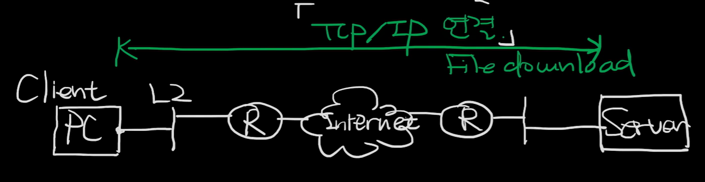

# 2024.04.23 학습
# TCP 소켓 통신

- TCP 송/수신 원리
    
    
    
    연결 : 3-way handshake
    
    tcp연결을 한 후 파일을 하나 다운받는 상황
    
    - 서버 쪽에서 어떠한 파일 하나를 가지고 있다가 파일을 클라이언트가 달라고 하니 송신
    
    서버 프로그램이 작동을 하고 있을 때 소켓이 하나 열려 있을 것이다. 이 소켓으로 클라이언트와 연결을 하고 있을 것이다.
    
    - 소켓의 본질은 file이다.
    - 서버는 기본적으로 process이다.
    - process가 file에 할 수 있는 명령어는 기본적으로 RWX이지만 소켓 통신에서 실행이라는 개념이 있을 수 없으므로 기본적으로 Read 혹은 Write일 것이다.
    - 소켓 통신에서는 읽는다는 개념과 쓴다는 개념을 다른 언어로 부른다
        - 읽는다는 것 Receive
        - 쓴다는 것 Send
    - process가 socket에 대고 I/O를 한다
    
    하드 디스크나, ssd인 2차 메모리 안에 file이 들어 있을 것이다. 파일이라는 것이 예를 들어 a.bmp라고 한다면 파일이라는게 file system이라는 것에 관리가 될 것이며 하드디스크에 Device driver가 존재 할 것이며 file system과 driver가 정보가  주거니 받거니 이루어 질 것이다.
    
    메모리를 할당 하게 되어 있다.
    
    - 메모리가 크다고 가정을 한다. 메모리의 크기를 얼마로 잡을지는 개발자가 정한다.
    - 만약 1.4MB의 크기라고 한다면 예를 들어 64KB로 잡는다고 하자
    - 데이터를 읽어 올 때 이 1.4MB의 크기를 한번에 읽어 오는 것이 아닌 64KB 정도로 끊어서 읽어 온다
- SSL/TLS
    
    
    
    HTTP는 TLS를 거치면서 암호화 및 보안 사항을 TLS가 해준다. 
    
    그 내용을 TCP, IP로 통신하게 된다.
    
    이 프로토콜을 사용하는 상대방이 있다고 한다면 이 상대방 또한 같은 TLS영역을 써야지만 당연히 통신이 가능 하게 된다.
    
    이렇게 보안적인 프로토콜을 사용하는 HTTP의 경우 HTTPS라는 이름을 붙이게 된다.
    
    양자간 통신을 하게 되면 데이터를 주고 받게 될 텐데 이 데이터를 안전하게 주고 받을 수 있는 방법은 
    
    1. 이 데이터를 갈취하고 싶은 사용자가 있을 때 이 제 3자가 데이터를 가지고 간다 하더라도 이 데이터를 읽을 수 없다면 된다.
    2. 내가 어떠한 데이터를 보내려고 할 때 이 데이터를 b라는 사용자에게 보내야 하는데 배달 사고가 나거나 다른 3자가 b라고 속여서 데이터를 가져가게 된다면 문제가 된다. 내가 보내고자 하는 데이터가 b에게 갔는가.
        1. 이 b가 내가 보내고자 했던 사용자 b인가를 증명
    
    TLS에서는 제3자가 데이터를 취득해도 해독이 불가능 하게 하기 위한 방법으로 데이터의 암호화를 사용해서 보내고자 하는 데이터의 무결성과 기밀성을 확보하게 된다. 
    
    전달하고자 하는 데이터가 전달되야 하는 상대에게 갔느지를 확인하는 방법으로서는 디지털 서명을 이용한 인증 방법을 채택하고 있다.
    
    ### 암호화(TLS)
    
    대칭키(AES)
    
    - a가 데이터를 b에게 전달 하려 할 때 보내고자 하는 데이터를 암호화 하게 되는데 이 보내고자 하는 데이터의 암호화를 대칭키라고 하는 키를 이용해서 암호화 하게 된다. 그러면 암호화된 데이터가 생성되게 되고 이 암호화된 데이터를 전달하게 되면 b는 받은 데이터를 대칭키를 이용해서 복호화하게 되면 a가 보낸 데이터를 원복화하게 된다. 이 대칭키는 특징은 서로간의 같은 키를 공유하게 되면 똑같은 키를 이용하여 서로간의 통신을 하게 된다. 문제점은 이 키를 누군가 제 3자가 취득하게 된다면 제 3자 또한 a, b사이의 데이터를 훔쳐서 충분히 볼 수 있다. 장점은 비대칭키 보다 컴퓨팅 자원을 덜 사용한다.
    
    비대칭키(RSA)
    
    - 대칭키의 단점을 보안한 방법
    - a가 b와 통신을 하려고 하는데 비대칭키를 a는 생성한다 2개의 키를 생성한다. 이 비대칭키의 특징은 내가 데이터를 하나의 키로 암호화 하게 되면 암호화된 데이터는 꼭 쌍이 되는 다른 키로만 복호화가 되서 데이터가 된다.
    - 2가지 키를 이용해서 a는 생성된 키를 b에게 전달하게 된다. b는 a에게 키를 전달받게 되고 b는 a에게 데이터를 전달하게 될 때 a에게 받은 키로 암호화 하여 전달하며 a는 자신의 키를 이용해 복호화 하게 된다.
    - 제 3자가 b의 키를 가지고 b가 보내려고 하는 데이터를 복호화 하려고 한다면 불가능 하다. a의 키를 가지고 있어야 복호화가 되기 때문에
    - a가 b와 데이터를 주고 받을 때 a는 자신의 primary key를 만들고 다른 사람이 사용 할 수 있는 public key를 만들어 공개를 하게 된다. b 또한 a와 데이터를 주고 받고 싶을 때에도 b는 개 인 키와 공개 키를 만들어서 공개 키를 a에게 전달하면 된다.
    
    통신의 상대가 맞는지 확인하는 방법
    
- Amazon API Gateway에서 양방향 TLS 인증
    
    [🎲링크](https://aws.amazon.com/ko/blogs/tech/mutual-tls-authentication-using-aws-iot-private-ca/)
    
    [🏆위키독스 링크](https://wikidocs.net/125373)
    
    사전 준비 사항
    
    - AWS Account
    - AWS 리전 : 발급 받은 SSL/TLS 도메인이 한국 도메인 이기 때문에 AWS 리전은 Asia Pacific(Seoul)을 사용한다.
    
    단계 요약
    
    1. Private CA 생성
        1. Private CA로 사용할 인증서를 생성한다. 인증서를 생성할 때는 ‘openssl’ 명령어를 이용한다.
        
        ```markdown
        // Private Key Pair 생성
        % openssl genrsa -out HMCRootCA.key 4096
        
        % openssl req -x509 -new -nodes -key HMCRootCA.key -sha256 -days 1024 -out HMCRootCA.pem
        
        // rootCA_openssl.conf 생성
        % nano rootCA_openssl.conf
        
        // rootCA_openssl.conf에 아래와 같이 입력합니다.
        [ req ]
        distinguished_name = req_distinguished_name
        extensions = v3_ca
        req_extensions = v3_ca
        [ v3_ca ]
        basicConstraints = CA:TRUE
        [ req_distinguished_name ]
        countryName = Country Name (2 letter code)
        countryName_default = KR
        countryName_min = 2
        countryName_max = 2
        organizationName = Organization Name (eg, company)
        organizationName_default = Inc.
        
        // CSR 파일 생성
        % openssl req -new -sha256 -key HMCRootCA.key -nodes -out HMCRootCA.csr -config rootCA_openssl.conf
        
        // PEM 파일 생성
        % openssl x509 -req -days 3650 -extfile rootCA_openssl.conf -extensions v3_ca -in HMCRootCA.csr -signkey HMCRootCA.key -out HMCRootCA.pem
        // Private Key Pair 생성
        % openssl genrsa -out HMCRootCA.key 4096
        
        % openssl req -x509 -new -nodes -key HMCRootCA.key -sha256 -days 1024 -out HMCRootCA.pem
        
        // rootCA_openssl.conf 생성
        % nano rootCA_openssl.conf
        
        // rootCA_openssl.conf에 아래와 같이 입력합니다.
        [ req ]
        distinguished_name = req_distinguished_name
        extensions = v3_ca
        req_extensions = v3_ca
        [ v3_ca ]
        basicConstraints = CA:TRUE
        [ req_distinguished_name ]
        countryName = Country Name (2 letter code)
        countryName_default = KR
        countryName_min = 2
        countryName_max = 2
        organizationName = Organization Name (eg, company)
        organizationName_default = Inc.
        
        // CSR 파일 생성
        % openssl req -new -sha256 -key HMCRootCA.key -nodes -out HMCRootCA.csr -config rootCA_openssl.conf
        
        // PEM 파일 생성
        % openssl x509 -req -days 3650 -extfile rootCA_openssl.conf -extensions v3_ca -in HMCRootCA.csr -signkey HMCRootCA.key -out HMCRootCA.pem
        ```
        
    2. AWS IoT Core에 Private CA 등록
        1. 1단계에서 생성한 Private CA를 AWS IoT Core에 등록한다. - 우리는 다른 곳을 찾아야 할듯. IoT가 아니므로
            1. AWS Console → AWS IoT Core → 보안 → 인증 기관 → CA 인증서 등록 메뉴 이동
    3. 디바이스 인증서 생성
    4. Domain Name Server 구성
    5. Custom Domain Name 구성
    6. 구성 테스트 하기
    
- TLS 도전 해보기
    1. 인증서와 키 파일 준비
        
        TLS 통신을 위해서 서버 인정서(server.crt), 서버 키(server.key) 그리고 CA인증서(CA.pem)파일이 필요하다. OpenSSL을 사용하여 이 파일들을 생성할 수 있다.
        
    2. Spring Boot 프로젝트 설정
        
        Spring Boot와 Reactor Netty를 사용하는 프로젝트에 ‘application.properties’ 혹은 ‘application.yml’ 설정 파일에 다음과 같은 TLS 설정을 추가한다.
        
        ```java
        # application.properties
        server.port=8443
        server.ssl.key-store=classpath:keystore.p12
        server.ssl.key-store-password=your_keystore_password
        server.ssl.keyStoreType=PKCS12
        server.ssl.keyAlias=server_key
        ```
        
        여기서 ‘keystore.p12’는 OpenSSL로 생성한 ‘server.key’와 ‘server.crt’를 포함하는 Java KeyStore파일이다. 이 파일은 다음 OpenSSL 명령어로 생성할 수 있다.
        
        ```bash
        openssl pkcs12 -export -out keystore.p12 -inkey server.key -in server.crt -name server_key
        ```
        
        명령어 실행 시 필요한 비밀번호를 설정하고, 이 비밀번호는 ‘your_keystore_password’에 해당한다.
        
    3. Reactor Netty 서버 설정
        
        Spring Boot와 Reactor Netty를 사용할 때, ‘NettyReactiveWebServerFactory’를 커스터마이징하여 SSL 설정을 추가할 수 있다.
        
        ```java
        import org.springframework.context.annotation.Bean;
        import org.springframework.context.annotation.Configuration;
        import reactor.netty.http.server.HttpServer;
        
        @Configuration
        public class NettyConfig {
        
            @Bean
            public NettyReactiveWebServerFactory nettyReactiveWebServerFactory() {
                NettyReactiveWebServerFactory webServerFactory = new NettyReactiveWebServerFactory();
                webServerFactory.addServerCustomizers(server -> server.secure(sslContextSpec -> sslContextSpec
                    .sslContext(SslContextBuilder.forServer(
                        new File("path/to/server.crt"),
                        new File("path/to/server.key")
                    ))));
                return webServerFactory;
            }
        }
        ```
        
    4. 클라이언트 측 SSL 설정
        
        Java 클라이언트 에서 서버로의 안전한 연결을 보장하기 위해 ‘SslContext’를 사용할 수 있다.
        
        ```java
        SslContext sslContext = SslContextBuilder
            .forClient()
            .trustManager(new File("path/to/CA.pem"))
            .build();
        
        HttpClient client = HttpClient.create()
            .secure(sslContextSpec -> sslContextSpec.sslContext(sslContext))
            .host("localhost")
            .port(8443);
        ```
        
        이렇게 설정하면 Java 환경에서 Reactor Netty를 사용한 서버와 클라이언트 간의 TLS 보안 연결을 구성할 수 있다.
        

---

- TCP 소켓 통신과 Redis를 사용 할 때 보안 방법
    
    
    ### 패킷을 보호하는 기술
    
    ```markdown
    암호화
    
    제 3자가 쉽게 읽을 수 없도록 하는 것 - 암호화
    
    원래대로 되돌리는 것 - 복호화
    ```
    
    ```markdown
    전자 서명
    
    데이터가 변경되지 않았는지를 판단하는 장치
    
    - 송신측
    1. 데이터를 특수한 방법으로 수치화한다.
    2. 산출한 수치를 암호화한다.
    3. 암호화한 수치와 데이터를 보낸다.
    
    - 수신측
    1. 암호화된 수치를 복호화한다.
    2. 송신측과 같은 방법으로 데이터를 수치화하고, 1에서 얻은 수치와 똑같으면 데이터가 변경되지 않았다고 판단.
    ```
    
    ```markdown
    보안 프로토콜
    
    암호화나 인증을 수행하는 보안 프로토콜을 사용하면, TCP/IP 통신의 안정성을 강화 할 수 있다.
    
    SSH(Secure Shell)
    - 원격 로그인시 통신을 암호화하는 프로토콜
    
    SSL(Secure Socket Layer)
    - 데이터를 암호화하는 프로토콜
    
    IPsec(IP Security)
    - IP 데이터그램의 인증이나 암호화를 수행하는 프로토콜의 총칭
    ```
    
    ```markdown
    방화벽
    
    외부 공격으로부터 컴퓨터를 보호하는 장치
    
    패킷을 제어하고 싶은 곳에 설치. 확인이 완료된 패킷만 통과할 수 있다.
    
    기본적인 동작
    - 외부망과 연동하는 유일한 창구로서 외부로부터 내부망을 보호하기 위해 
    각 서비스(ftp, telnet, web등) 별로 서비스를 요구한 시스템의 IP주소 및 port 번호를
    이용하여 외부의 접속을 차단하거나 또는 사용자 인증에 기반을 두고 외부접속을 허용 및 차단한다.
    방- 방화벽이 정보보호의 기본이며 가장 효과적인 대책.
    ```
    
    
    
    ---
    
    웹과 같이 단순한 데이터 교환을 위한 연결은 http 통신이 좋다.
    
    - 웹서버 - 웹 클라이언트 간 통신을 위해 디자인 된 프로토콜로, 클라이언트의 요청 및 서버의 응답 처리 방식으로 통신한다. 기본적으로 무상태(stateless)프로토콜이기에 서버는 요청 간 상태 유지를 하지 않는다.
    - http header를 통해 통신 방법(메서드), 캐시, 쿠기, 데이터 타입 등의 정보를 담는다.
    
    그러나 게임과 같이 실시간 통신이 필요하다면 tcp 혹은 udp 통신이 좋다.
    
    - tcp 통신 : 클라이언트 와 서버, 혹은 각기 다른 두 프로그램이 양방향으로 통신할 수  있는 프로토콜 방식
    - Port, 시퀀스 번호, 데이터 오프셋 등을 지니는 헤더를 담는다.
        
        
        
    
    ---
    
    blowfish 적용 암/복호화 처리
    
    - 보내는 쪽에서 암호화 처리 해서 송신
    - 수신하는 쪽에서 복호화 처리해서 데이터 처리
    - 비용 면에서 효율적
    - 암/복호화 하는데 있어 처리 되는 속도가 지연되거나 하지 않기 때문에 사용 할 만하다.
    
    통신 구간을 암호화 하기 위해서는 인증서 등의 방법 사용, 전용선 사용
    
    ---
    
    TCP 서버와 클라이언트가 패킷을 주고 받을 때 현업에서 보안 처리 하는 방법 질문
    
    - 패킷 헤더를 제외한 나머지 부분을 간단한 대칭키 암호를 이용해 암호화 하는게 일반적
    - XOR, shift를 이용
    - 어짜피 클라이언트는 얼마든지 조작이 가능하고 클라에 저장된 키값도 어떻게든 추출이 가능하니, 암호화에 엄청 힘쓰는건 무의미하다고 볼 수 있다.(개인적 의견)
    
    ---
    
    ### TCP 통신의 보안
    
    1. TLS(Transport Layer Security)
        1. 장점 : 데이터 무결성 및 기밀성을 보장하며, 인증서를 통해 클라이언트와 서버 간의 신원을 확인할 수 있다.
        2. 단점 : 암호화와 복호화 과정에서 CPU 사용량이 증가하며, 초기 연결 설정 시 속도가 느려 질 수 있다.
        3. 사용 빈도 : 현업에서 가장 널리 사용되는 방법, 많은 온라인 서비스에서 표준으로 채택하고 있다.
    2. 데이터 암호화(XOR, shift등)
        1. 장점 : 구현이 간단하고 속도가 빠르다.
        2. 단점 : 보안 수준이 낮고, 기본적인 보호 기능만 제공
        3. 사용 빈도 : 주로 제한된 리소스를 가진 환경이나 빠른 처리가 필요한 시스템에서 사용한다. 실시간 게임 서버에서는 일반적으로 권장되지 않는다.
    
    ### Redis의 보안
    
    1. 암호화
        1. 장점 : 저장되는 데이터가 외부에서 보호된다.
        2. 단점 : Redis는 기본적으로 내부 데이터를 암호화하지 않으므로, 애플리케이션 레벨에서 암호화를 구현해야 한다.
    2. 액세스 제어 (Access Control Lists, ACL)
        1. 장점 : 사용자 및 명령 수준에서 접근을 제한하여 보안을 강화할 수 있다.
        2. 단점 : 관리가 복잡해질 수 있다.
    3. SSL/TLS를 통한 데이터 전송 보안
        1. 장점 : 데이터 전송 시 암호화를 통해 정보를 보호한다.
        2. 단점 : 성능 저하가 발생할 수 있다, 서버의 리소스가 많이 소모될 수 있다.
    
    추천 방법 - Redis 인스턴스에 SSL/TLS를 적용하고, 가능한 경우 데이터를 애플리케이션 레벨에서 암호화하여 저장하는 것이 좋다. 또한, ACL을 통해 불필요한 접근을 제한한다.
    
    ---
    
    ### 소켓 통신을 진행 함에 있어 보안 사항
    
    - TLS 사용
    - 데이터 유효성 검사
        - 서버 측에서는 클라이언트로부터 받은 모든 데이터에 대해 유효성 검사를 수행해야 한다.
        - ex) 플레이어가 아이템을 생성하거나 수정할 권한이 있는지, 전송된 아이템 데이터가 게임의 규칙과 일치하는지 등
    - 클라이언트 사이드 보안 강화
        - 클라이언트 어플리케이션을 난독화하여 리버스 엔지니어링을 어렵게 만든다. 이는 비지니스 로직이나 중요한 데이터가 클라이언트 코드 내에 노출되는 것을 방지한다.
        - 클라이언트 소프트웨어에 무결성 검사를 추가하여 변조를 탐지할 수 있다.
    - 레이트 제한 및 이상 행동 감지
        - 플레이어의 요청 빈도가 비정상적으로 높은 경우 레이트 제한을 적용하여 서비스 거부 공격(Denial-of-Service, DOS)및 자동화된 스크립트 공격을 방지한다.
        - 이상 행동 감지 시스템을 구축하여 플레이어의 비정상적인 행동 패턴을 식별하고 조치를 취할 수 있다.
    
    [Netly - c-sharp를 기반으로 구축된 소켓 라이브러리 이자 오픈 소스](https://assetstore.unity.com/packages/tools/network/netly-tcp-udp-ssl-tls-225473?locale=ko-KR)
    
    - 멀티플레이 게임, 채팅 및 프로세스 간 통신을 만들기 위해 (TCP, UDP, SSL/TLS, WEBSOCKET)라이브러리를 사용하려면 이 라이브러리가 필요했다.
        
        ---
        
    
    ### 해쉬화(Hashing)
    
    해쉬화는 데이터를 해쉬 함수를 통해 고정된 크기의 데이터 조각으로 변환하는 프로세스. 이 과정에서 원본 데이터를 직접적으로 복구하는 것은 사실상 불가능하다.
    
    - 장점
        - 데이터 무결성 보장 : 해쉬값을 통해 데이터가 변경되었는지 확인 가능
        - 비교적 빠른 처리 : 대량의 데이터를 빠르게 처리할 수 있다.
        - 보안성 향상 : 원본 데이터를 복원하기 어렵기 때문에 보안성이 향상
    - 단점
        - 암호화된 데이터 복구 불가 : 데이터를 복구하는 것이 불가능하므로, 원본 데이터가 필요한 경우 사용하기 어렵다.
    
    해쉬화는 주로 패스워드 저장, 데이터 무결성 검증 등에 사용된다. 예를 들어 사용자의 패스워드를 데이터베이스에 저장할 때 해쉬값으려 변환하여 저장함으로써, 실제 패스워드가 노출되지 않도록 보호 할 수 있다.
    
    ---
    
    TPS(Transaction Per Second)
    
    - 초당 몇개의 명령을 처리할 수 있는가
    - ex) MAX 1000 TPS = 1초에 1000개의 명령을 처리
    - CPU, 메모리, 디스크 등 하드웨어 적인 부분이 속도에 영향을 미친다.
    - 너무 많은 경우 오래걸리거나 장비가 고장 날 수 있다.
    
    해결 방법
    
    RPC를 통한 게이트웨이 역할을 하는 서버 구성
    
    - HTTP보다 더 작은 데이터를 UnMarshal, Marshal하여 전송을 함으로써 서버간 통신에 있어서 리소스를 줄이게 된다.
    - 실제 실무에서는 HTTP통신을 주로 사용을 하지만 자주 호출되는 부분에 대해서는 리소스를 절감해야 한다.
    
    ---
    
    온라인 게임 해킹은 클라이언트 분석으로부터 시작되며, 클라이언트 분석은 반드시 디버깅 작업이 필수적으로 선행되기 때문에 게임 클라이언트에 대한 디버깅 시도는 모두 탐지하고 무력화되어야 한다.
    
    또한 보안 솔루션(우리는 서버)에서 게임 클라이언트가 사용자에 의해 디버깅 중인지 아닌지 실시간으로 탐지되어야 한다. - 안티 디버깅 기능이 구현되어야 한다.
    
    ---
    
    온라인 게임에서는 이용자들이 플레이를 하면서 획득한 경험치, 아이템들에 대한 기록을 실시간으로 기록 및 반영해야 하기 때문에 게임플레이 중 발생한 기록들을 데이터베이스 또는 로그파일의 형태로 저장을 하고 있따. 이렇게 저장된 기록을 이용하여, 시스템 장애로 인해 반영되지 못한 데이터들이 있는지 대조를 하는데 사용하거나, 게임 내 버그를 이용하여 치팅(cheating)플레이를 한 이용자를 적발하거나, 게임 내 아이템을 부정한 방법으로 획득하여 부정한 이익을 얻은 불량 이용자들을 탐지하는데 활용하고 있다.
    
    ### 온라인 게임 보안의 세대별 분류
    
    1세대는 클라이언트 단에서 역공학 방지 기술을 이용하여 온라인게임 치팅 툴(매트로, 게임핵, 메모리 변조 프로그램 등)이 게임 클라이언트 ㅍ로그램을 후킹하여 게임 클라이언트에서 게임 서버로 전송되는 데이터를 위변조 하는 것을 차단 하는 기술이다. 이는 데이터기반 보안이 적용되지 않은 가장 고전적인 온라인게임 보안기술로서, 온라인 게임 태동기부터 2000년대 초반까지 주로 활용된 기술이라 할 수 있다.
    
    2세대는 본격적으로 데이터기반 보안 기술이 적용되기 시작한 시점으로 볼 수 있으며, 2000년대 초반부터 2010년 정도까지 주로 MMORPG 장르에 적용되어 왔다. 이 시기에는 서버단에서 데이터마이닝 기법을 이용하고, Decisino Tree, Random Forest, SVM 과 같은 전통적인 분류기(classifier)를 적용하여 정상 이용자와 비정상 이용자로 분류하는 수준이라고 볼 수 있다.
    
    3세대에서는 서버단에서 데이터마이닝을 이용하되, 분석의 정확도를 높이고 분석 부하량을 낮추기 위해 선별적인 외과적 수술 방식으로 부정이용자들을 탐지해내는 방식으로 진화화였다.
    
    딥러닝 기술을 적극 반영하여 탐지 정확도를 향상시키는 형태로 진화.
    
    소셜네트워크 분석기술과 접목시킨 분석기법 등 hybrid 한 기법들이 다양하게 적용되어가고 있다.
    
    ---
    
    ### 모바일 게임 해킹 유형
    
    1. 변조(Tampering) 공격
        
        게임 내의 메모리, 파일 등을 변조하여 게임을 불공정하게 이용하는 해킹 유형. 위변조 공격에는 파일단 변조, 메모리단 변조 그리고 데이터 변조 세가지 유형이 있다.
        
        - 파일단 변조
            - 파일단 변조는 정적 분석을 통하여 게임 파일에 저장되어 있는 코드와 데이터를 변조하는 유형이다.
            - 게임 내 파일과 데이터를 분석하여 게임이 원하는 방식으로 동작하도록 변조한다. 일반적으로 모바일 디바이스의 루트 권한을 획득하여 게임 파일에 있는 코드와 데이터에 무단으로 접근하여 변조를 진행한다.
        - 메모리단 변조
            - 메모리단 변조는 동적 분석을 통하여 게임이 실행중일 때 메모리 코드와 데이터를 변조하는 해킹 공격이다. 게임이 실행 중일 때 구동을 위하여 게임 게임의 메모리 코드와 데이터를 변조하여 인게임에서 돈, 체력, 능력치 등을 변조하는 해킹 유형이다. 메모리단 변조 공격으로는 해킹방식으로 게임 구동 파일인 DLL을 변조하여 삽입하는 DLL인젝션 공격과 게임앱의 메모리를 실시간 으로 스캐닝하고, 변조하는 게임 가디언, 럭키 패처와 같은 게임 치트툴을 활용한 해킹 공격이다.
        - 데이터 변조
            - 데이터 변조는 게임의 내/외부 파일 데이터, 네트워크 데이터, 그리고 메모리 데이터를 무단으로 변경이나 조작하는 해킹 유형.
            - 해커는 게임 클라이언트를 직접 해킹하여 사용자의 장치에 있는 데이터를 변조하거나 네크워크 패킷 탈취 및 중간자 공격을 통하여 서버랑 교환된느 데이터를 변조할 수 있다.
    
    1. 클라이언트 변조 / 리패키징
        
        원본 코드를 추출하여 재배포하는 공격
        
        해커는 소스코드에 접근해 클라이언트를 변조함으로써 금액을 지불해야만 사용할 수 있는 프리미엄 기능(게임 내 스킨, 맵 등)을 무단으로 사용할 수 있다. 리패키징을 통해 유료게임을 무료로 이용 또는 배포할 수 있으며, 패키징 하는 과정에서 앱을 변조해 불법적인 모드(Mod)를 제작할 수 있다.
        
    2. 자동화 스크립트 및 봇 사용
        
        자동화 스크립트 및 봇을 활용하여 비정상적인 방법으로 게임을 이용하는 공격 방식. 일반적으로 매크로라고 알려져 있는 툴을 이용하여 플레이어의 개입 없이 게임 내 반복적인 작업을 자동화 하여 게임을 이용하는 방법.
        
    
    ### 모바일 해킹 대응 방법
    
    1. 암호화
        
        암호화는 앱의 코드 또는 평문의 데이터를 읽을 수 없는 데이터로 변환하는 기술.
        
        암호화된 데이터 또는 코드는 암호화 키 없이는 복호화할 수 없다. 데이터 및 메모리 변조를 하기 위해서는 해킹해야 하는 데이터 또는 코드의 위치와 알고리즘을 파악해야 하지만 암호화가 되어 있다면 암호화 키 없이는 파악 할 수 없어 변조를 불가능 하게 한다.
        
    
    1. 무결성 검사
        
        
        
        앱의 데이터와 시스템이 변조 또는 변경, 손상되어 있지 않은 상태를 유지하고 있는지 검사해 게임에 부정행위 및 해킹 공격이 가해졌는지 확인하는 보안 기법.
        
        무결성을 검증하는 방법으로는 게임 내 재화오 같은 데이터 또는 사용자의 입력값이 서버와 일치하는 검증을 하거나 디지털 서명을 통해 게임이 출시된 원본 상태 그대로인지 확인하는 방법이 있다.
        
    2. 패킷 탈취 방지
        
        
        
        네트워크 패킷 탈취를 게임과 서버 간의 통신이 되는 데이터를 중간에서 가로채고 분석하여 통신 프로토콜과 데이터를 이해하고 이를 수정 및 변조하여 게임 자원을 변경하거나 인증을 우회하여 게임 서버에 접속할 수 있다. 더 나아가 사용자의 개인정보를 탈취하여 유출시킬 수 있어 패킷 탈취를 방지하는 보안을 적용해야한다.
        
    3. 모니터링 및 로그 분석
    
    ---
    
    ### 패킷
    
    네트워크를 통해 전송되는 데이터의 기본 단위.
    
    네트워크에서 데이터는 대개 큰 덩어리로 전송되지 않고, 여러 개의 작은 덩어리, 즉 패킷으로 나뉘어 전송된다. 각 패킷에는 데이터 뿐만 아니라 그 데이터를 어디로 보내야 하는지, 어디서 왔는지 등의 정보를 포함하는 헤더도 포함되어 있다.
    
    패킷의 사용
    
    TCP 소켓 통신
    
    - TCP 소켓 통신에서 패킷은 근본적인 역할을 한다. TCP는 인터넷 프로토콜 슈트의핵심 프로토콜 중 하나로, 신뢰성 있는 바이트 스트림 전송을 제공한다. 데이터가 TCP를 사용하여 전송될 때, 데이터는 패킷으로 분할 되며, 각 패킷은 도착ㅇ르 확인하고 순서대로 재조합 될 수 있도록 제어 정보를 헤더에 포함한다.
    - 장점 : 데이터의 순서 보장, 데이터 전송의 신뢰성 보장, 데이터의 흐름 제어 및 혼잡 제어 기능 제공
    - 단점 : 비교적 높은 지연 시간과 오버헤드
    
    Redis
    
    - Redis에서는 패킷이라는 용어가 일반적으로 사용되지 않는다. Redis는 메모리 내 데이터 스토어로, 주로 TCP/IP 프로토콜을 사용하여 클라이언트와 서버 간 데이터를 주고 받는다. 그러나 이러한 데이터 전송 과정은 내부적으로 TCP 패킷을 사용할 수 있지만, Redis 자체적으로 패킷 수준에서 작업을 처리하는 것은 아니다.
    - Redis의 작업은 주로 키-값 스토어 관리, 데이터 쿼리 및 조작 등이며, 이는 데이터가 네트워크를 통해 전송되기 전의 레벨이다.
    
    게임 보안에서의 패킷
    
    게임 보안에서 패킷은 주로 네트워크 트래픽의 분석 및 조작과 관련이 있다. 게임 데이터가 클라이언트와 서버간에 전송될 때, 이 데이터는 패킷 형태로 전송되며, 공격자는 이러한 패킷을 가로채거나 조작하여 게임을 부정하게 이용하려 할 수 잇다.
    
    - 보안 위협 : 패킷 스니핑(가로채기), 패킷 조작, 패킷 분석 등
    - 보안 대책 : 패킷 암호화(TLS등), 패킷 검증,  보안 프로토콜 적용 등
    
    Redis를 사용할 때 클라이언트와 서버간의 데이터 전송은 TCP 소켓을 통해 이루어진다. TCP 소켓 연결이 설정되면, 데이터 전송은 자동으로 패킷 형태로 처리된다. 이는 TCP 프로토콜의 기본 작동 방식으로, 네트워크 계층에서 자동으로 관리된다.
    
    ### TCP 소켓 통신의 작동 방식
    
    1. 패킷 형성 : 클라이언트 또는 서버에서 데이터를 전송하려 할 때 TCP 프로토콜은 데이터를 패킷으로 분할한다. 각 패킷은 페이로드(실제 데이터), 헤더(소스 및 복적지 포트, 순서 번호, 확인 응답 번호 등의 메타데이터 포함), 그리고 때로는 트레일러(데이터 무결성 검사를 위한 정보)를 포함한다.
    2. 데이터 전송 : 패킷은 네트워크를 통해 전송된다. TCP는 각 패킷이 목적지에 도착했는지 확인하고 도착하지 않은 패킷은 재전송 요청을 한다.
    3. 데이터 재조합 : 수신 측에서는 여러 패킷을 받아 원래의 데이터 순서대로 재조합한다.
    
    ### 추가적인 서버 측 작업
    
    1. 보안 적용 : TLS 같은 보안 프로토콜을 적용하여 데이터 전송 과정에서 패킷의 암호화를 보장하는 것이 중요하다. 이는 외부 공격자로부터 데이터를 보호하며 데이터 무결성을 유지할 수 있도록 한다.
    2. 성능 모니터링 및 최적화 : 대규모 게임에서는 많은 수의 동시 연결과 데이터 전송이 이루어진다. 이에 따라 서버는 네트워크 트래픽을 모니터링하고, 필요에 따라로드 밸런싱과 같은 최적화 기법을 적용할 수 있다.
        - TPS를 운영할 때 RPC를 통한 게이트웨이 역할을 하는 서버를 구성하는 방식으로 처리 가능
        
        ### **RPC 게이트웨이 서버의 역할**
        
        1. **로드 밸런싱**: 게이트웨이 서버는 네트워크 트래픽을 여러 백엔드 서버로 분산시키는 로드 밸런서 역할을 합니다. 이를 통해 단일 서버에 대한 부하를 줄이고, 전체 시스템의 처리 능력을 증가시킵니다.
        2. **요청 라우팅**: 클라이언트로부터 오는 요청을 적절한 서버로 라우팅함으로써, 특정 서비스 또는 데이터 관리를 전문화된 서버에 할당할 수 있습니다. 이는 서비스의 효율성을 높이고, 관리를 용이하게 합니다.
        3. **결함 격리 (Fault Isolation)**: 게이트웨이 서버는 시스템의 다른 부분에서 발생할 수 있는 장애를 격리하고, 장애 발생 시 빠른 복구를 가능하게 합니다. 이는 시스템 전체의 안정성을 강화합니다.
        4. **보안 게이트키퍼**: 보안 정책을 중앙에서 관리하고, 인증 및 권한 부여를 통해 서비스 액세스를 제어할 수 있습니다. 이는 시스템 전반의 보안을 강화하는 데 기여합니다.
        5. **성능 모니터링**: 게이트웨이 서버를 통해 네트워크 트래픽 및 서비스 요청의 성능 데이터를 수집하고, 이를 기반으로 시스템 최적화 결정을 내릴 수 있습니다.
        
        ### **구현 시 고려사항**
        
        - **확장성**: 시스템의 성장에 따라 게이트웨이 서버도 쉽게 확장할 수 있어야 합니다. 클라우드 서비스나 컨테이너화를 이용한 동적 스케일링이 유용할 수 있습니다.
        - **고가용성**: 게이트웨이 서버에 장애가 발생하면 전체 시스템에 영향을 줄 수 있으므로, 고가용성 구성이 필수적입니다.
        - **성능**: 높은 TPS를 지원하기 위해서는 게이트웨이 서버의 성능 최적화가 중요합니다. 캐싱, 비동기 처리 등의 기술을 적절히 활용할 필요가 있습니다.
        
        RPC를 통한 게이트웨이 서버 구성은 분산 시스템에서의 데이터 관리 및 요청 처리를 효율적으로 수행할 수 있게 해주며, 시스템의 성능, 확장성, 그리고 안정성을 대폭 향상시킬 수 있습니다.
        
        ---
        
        Redis를 사용하여 실시간으로 변경되는 데이터를 처리하는 경우
        
        인벤토리의 경우
        
        1. 해시화를 이용한 데이터 관리
            
            해시 데이터 구조 사용
            
            - Redis에서 해시 데이터 구조는 키와 값 쌍을 저장하는 데 아주 적합하다. 예를 들어 각, 플레이어의 인벤토리는 하나의 해시로 관리될 수 있으며, 이 해시는 아이템 ID를 키로 하고, 해당 아이템의 수량을 값으로 할 수 있다.
            - 장점 : 데이터 구조가 단순하고 접근이 빠르며, 각 아이템의 추가, 삭제, 업데이트가 용이하다.
            - 단점 : 데이터가 크게 변동될 때 모든 아이템 정보를 업데이트 해야 할 수도 있다.
            
            해시화의 역할
            
            - 해시화는 주로 보안 컨텍스트에서 사용되며, 데이터를 안전하게 저장하는 방법을 말한다.
        2. accessToken을 이용한 보안 접근
            
            토큰 기반 인증 사용
            
            - 클라이언트가 요청을 보낼 때마다, accessToken을 함께 전송하여 요청이 유효한지 검증하는 방법. Redis는 이 토큰들을 저장하고 관리할 수 있으며, 각 요청 시 토큰의 유효성을 확인하여 해당 요청이 유효한 사용자로부터 왔는지를 검증 할 수 있다.
            - 장점 : 보안성이 높고, 사용자 인증 절차가 명확하다.
            - 단점 : 토큰을 검증하는 과정에서 시간이 소요될 수 있고, 토큰 관리가 필요하다.
        
        결론 
        
        - Redis의 해시 데이터 구조를 사용하여 각 플레이어의 인벤토리를 관리하는 것이 효율적이다.
        - 보안의 측면에서는 accesstoken을 사용하여 각 요청의 인증을 처리하는 방식을 적용
        - 이렇게 두 가지를 조합하면 게임의 데이터 관리 및 보안 요구를 모두 충족시킬 수 있다.
        
        ### 해시화와 해시 데이터 구조의 구분
        
        해시화
        
        - 주로 데이터를 암호화하여 안전하게 저장하는 방법을 의미
        - 비밀번호와 같은 민감한 정보를 안전하게 저장할 때 사용.
        
        해시 데이터 구조
        
        - Redis와 같은 키-값 저장소에서 데이터를 효율적으로 관리하기 위해 사용되는 자료 구조
        - Redis의 해시 데이터 구조는 키-값 쌍의 컬렉션으로, 각 키는 플레이어의 유니크 ID와 같은 식별자일 수 있고, 값은 해당 플레이어의 인벤토리를 나타내는 또 다른 키-값 쌍의 집합이다.
        - 예시
            - Redis 해시 키 : player:1234
            - 값:{”item_id1": "3", "item_id2": "5"} (여기서 "item_id1"과 "item_id2"는 아이템 ID, "3"과 "5"는 해당 아이템의 수량)
        
- TLS 연결
    
    [CentOS7, Apache를 활용한 HTTPS환경 구성](https://cntechsystems.tistory.com/172)
    

- 비대칭키는 단방향으로 기밀성을 보장하지만, 암호화/복호화에 드는 비용이 크기 때문에 일반적인 암호화 통신에는 대칭키 암호화를 사용한다. 대표적인 암호로는 RSA나 DSA가 있다.
- 디지털 인증서는 모두가 신뢰할 수 있는 제삼자인 CA와 비대칭키 암호화가 필요하다.
    - **밥은 우선 CA에게 자신이 밥임을 다양한 방식으로 증명하고 자신의 공개 키가 밥의 공개 키가 맞음을 인증하는 인증서를 발급받습니다. 이후 앨리스에게 이 인증서를 주면, 앨리스는 자신이 신뢰할 수 있는 CA가 발급한 올바른 인증서인지 확인하고, 맞으면 그 인증서에 포함된 밥의 공개 키로 데이터를 암호화해서 전달합니다. 만약 밥이 이것을 올바르게 복호화한다면 CA가 인증하는 밥의 공개 키에 대응하는 개인 키를 가지고 있다는 것이므로, 이 과정을 통해서 현재 통신하고 있는 상대방이 밥이 맞음을 인증할 수 있습니다.**
    
    
    
- 비대칭키 암호화인 RSA를 사용한 키 합의 프로토콜
    - 앨리스가 밥의 공개 키를 알고 있기 때문에, 앨리스는 앞으로둘의 통신에 사용할 세션 키를 만들어  이를 밥의 공개 키로 암호화한 다음 밥에게 전송한다.
    - 이를 복호화할 수 있는 개인 키를 가지고 있는 사람은 밥 뿐이므로 제 3자인 이브는 세션 키를 얻을 수 없고, 앨리스와 밥은 안전하게 세션 키를 교환하여 보안 채널을 만들 수 있다.
    - 하지만 겉보기에는 안전해 보이는 이 방식에는 새로운 보안 문제가 있다.
    - 순방향 비밀성 (Forward Secrecy)
        - 밥의 개인 키를 모르는 이브는 우선 둘의 모든 통신을 기록해 둔다. 왜냐하면 언제가 될지는 모르지만, 밥의 개인 키를 알아내기만 하면 그동안 기록해 둔 것을 복호화해서 앨리스가 밥에게 보낸 세션 키를 얻을 수 있고, 세션 키를 얻으면 둘의 대화 내용을 알아 낼 수 있기 때문
        - 예를 들어 2014년에 세상을 떠들썩하게 했던 Heartbleed버그가 있다.
            - 이 버그는 OpenSSL 구현의 취약점으로, 공격자가 서버의 메모리상에 존재하지만 허가되지 않은 데이터를 얻을 수 있게 한다. 이러한 방법이든 아니면 또 다른 방법이든 밥의 개인 키가 유출되고 나면 앨리스와 밥의 통신은 개인 키가 유출되기 전에 이루어진 것이더라도 안전하지 않게 된다.
        - 이런 상황을 대비하여 현재에만 안전한 것이 아닌 미래에 개인 키가 유출되더라도 안전하게 하는 보안 목표를 순방향 비밀성(forward secrecy), 또는 완전 순방향 비밀성(perfect forward secrecy, PFS)라고 한다.

### 무결성

데이터의 무결성을 제공하기 위한 암호 기본 요소에는 해시 함수와 키 있는 해시 함수가 있다.


해시 함수 : 어떤 임의의 데이터를 입력으로 받아서 일정한 길이의 데이터로 바꾸어 주는 함수

해시, 해시값 : 해시 함수를 이용해서 나오는 결과인 일정한 길이의 데이터